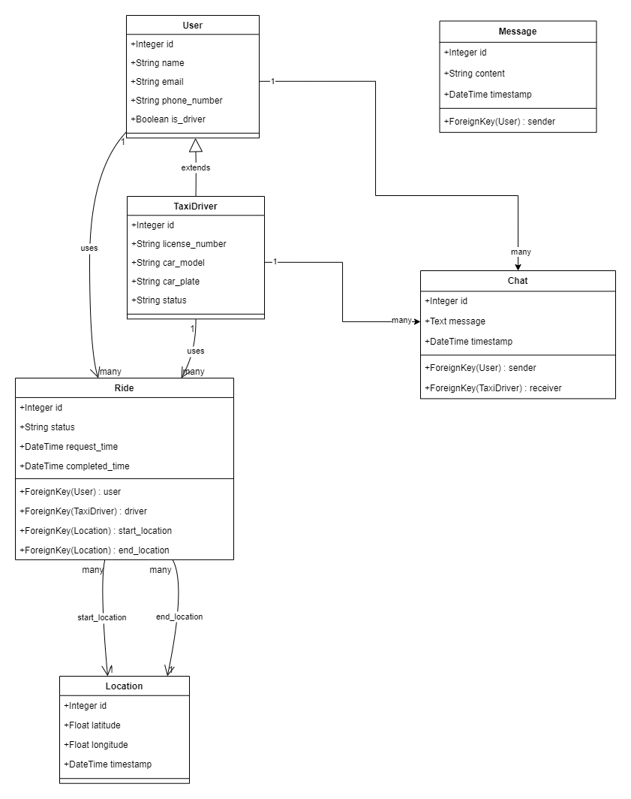

# Call Taxi

This is a project that will be used for submitting assignment 1145005-63 Web Development.

## Future Updates & Roadmap

**TODO:**

- [x] Project Planning
- [ ] Website design
- [ ] Backend degin 
- [ ] Setup & Configuration
- [ ] Database Design
- [ ] Frontend Development
- [ ] Backend Development
- [ ] Integration
- [ ] Testing
- [ ] Deployment & Hosting
- [ ] Optimization & Maintenance

This is a project developed in our free time to submit the teacher's work. Updates may be delayed.


## Setup Project
To install Project, run the following command

```bash
  git clone https://github.com/oatin/Call-Taxi.git
```
```bash
  pip install -r requirements
```


## Run

To run project, run the following command

```bash
  python manage.py runserver
```


## Project Structure

```plaintext
Call-Taxi/
│
├── call_taxi/           # Core booking functionality (ride requests, ride status)
├── chat/                # Real-time chat functionality between users and drivers
├── location/            # Location tracking for users and drivers
├── login/               # User authentication and Google OAuth login
├── static/              # Static files (CSS, JS)
├── templates/           # HTML templates for the app
├── manage.py            # Django management script
├── requirements.txt     # Python dependencies
└── README.md            # Project documentation
```

## Database Class Diagram


## Contributors
<a href="https://github.com/oatin/Call-Taxi/graphs/contributors" target="_blank">
  
</a>


## Support

For support, email fasai.ut.65@ubu.ac.th or join our Slack channel.